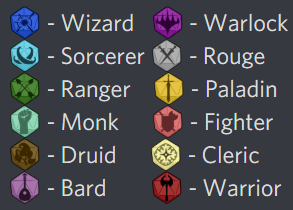

# DiscordArena
Creating a Discord Game with a website



# Development setup
Using: `Python 3.9`

### Run Api
`pip install -r api/requirements` Install requirements \
`docker-compose up` Start a development database \
`python -m api` Run Api

#### Default Postgres Settings 
`Username`: `postgres` \
`Password`: `postgres` \
`Connection`: `localhost:5432` \


### Run Bot
[Bot README.md](src/bot/README.md) \
`pip install -r bot/requirements` Install requirements\
`python -m bot` Run Bot


#### Known Issues

##### Windows
``` 
no matching manifest for windows/amd64 
in the manifest list entries
```
https://stackoverflow.com/a/51071057/13859228
