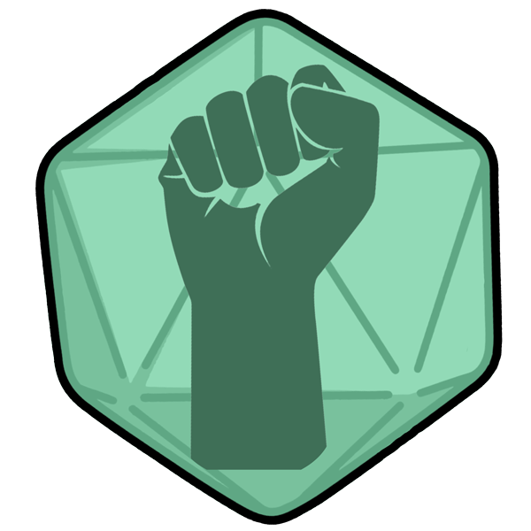

 

# DiscordArena 
Creating a Discord Game with a website

  
  
  
<br>
  
  
  
<br>


## Development Setup
Using: `Python 3.9`

_Prerequisite: [Install Docker](https://docs.docker.com/install) on your local environment._

### Run API
1. Install the necessary python packages with
```cmd
pip install -r src/api/requirements.txt
```
2. Add the necessary environment variables in your local `.env`
These can be found in `src/api/.env.example` and are listed below as well:

```
DATABASE_URL=
```
3. Start a development database with
```cmd
docker-compose up
```
4. Run the api with
```cmd
python -m api
```

#### Default Postgres Settings 
`Username`: `postgres` \
`Password`: `postgres` \
`Connection`: `localhost:5432` \


### Run Bot
[Bot README.md](src/bot/README.md) \
1. Install the necessary python packages with
```cmd
pip install -r src/api/requirements.txt
```
2. Add the necessary environment variables in your local `.env`
These can be found in `src/bot/.env.example` and are listed below as well:

```
TOKEN=
API_URL=
```
3. Run the bot with
```cmd
python -m bot
```


#### Known Issues

##### Windows
``` 
no matching manifest for windows/amd64 
in the manifest list entries
```
https://stackoverflow.com/a/51071057/13859228
